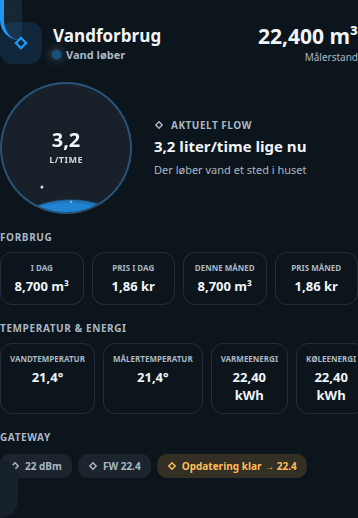

# Water Meter Card

## Neutral mobile preview



> Rendered at 390 px mobile width with fictional Home Assistant entities and values. No private dashboard, person, address, camera, or sensor data is included.


Et selvstændigt, tema-kompatibelt Lovelace-kort til Home Assistant. Kortet er flyttet fra en aktiv installation til et separat repository, så kildekode og versionshistorik kan vedligeholdes sikkert.

## Installation

Kopiér `ha-water-meter-card.js` til `/config/www/ha-water-meter-card/` og registrér ressourcen som et JavaScript-modul:

```text
/local/ha-water-meter-card/ha-water-meter-card.js?v=0.1.0
```

Tilføj derefter korttypen `custom:ha-water-meter-card` i Lovelace. De nødvendige entities angives i kortets konfiguration; repositoryet indeholder ingen installationens dashboardkonfiguration eller personlige data.

## Udvikling

```bash
npm run check
```

## Licens

MIT
